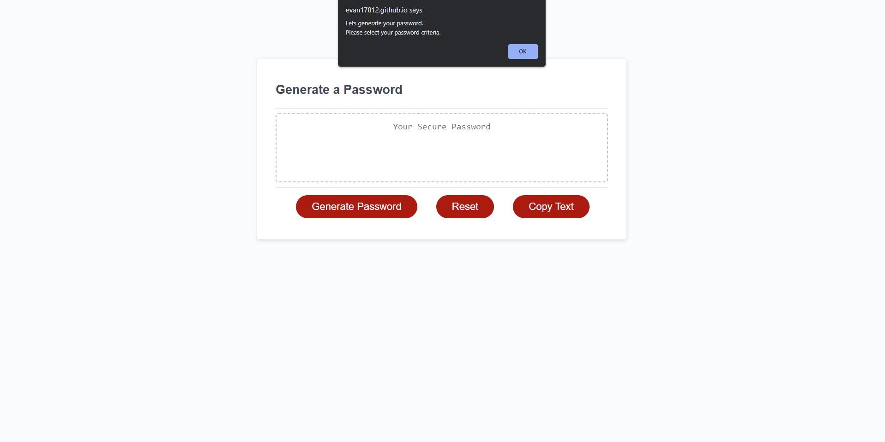

# Evan's Profile Page

## Description

The goal of this project was to use Javascript coding to create a password generator that would function under multiple different case scenarios. The generator would follow the criteria set forth by the user which can be choosen through the prompts that popup. This allows the user to choose the length of the password (minimum of 8 characters and maximum of 128 characters) and what characters to include (lowercase, uppercase, numerical, and special characters). In addition, it accounts for all possible scenarios， for instance, if no criteria was choosen or the password length was less than 8 or greater than 128, the prompt would ask the user to reinput correct values. I also added a reset button to refresh the page as well as a copy button to copy the generated passcode for convenience.

## Link
https://evan17812.github.io/Password-Generator/

## Screenshot
